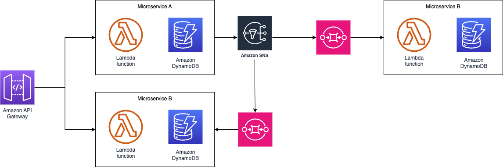

# Serverless micro services with golang and aws cdk

Serverless micro services with golang and aws cdk , and architecture overview. 

## Deploy

0. `aws configure`
1. `cd infra`
2. `cdk deploy`

# TODO:

- Events router within names microservice
